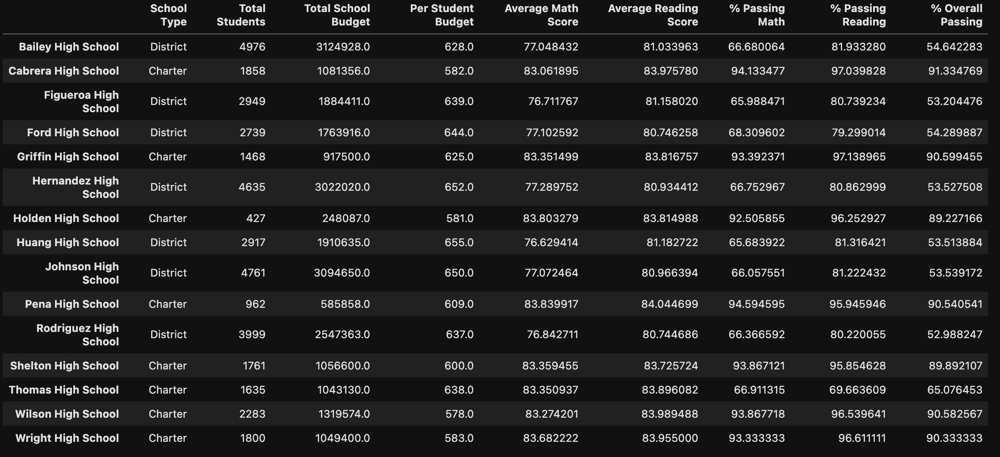
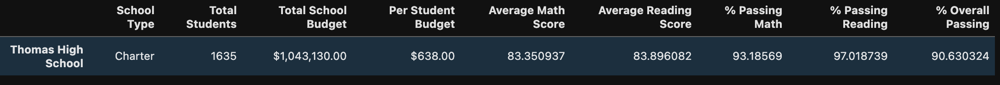
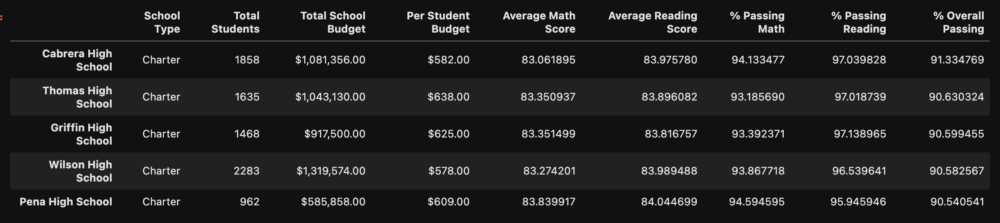
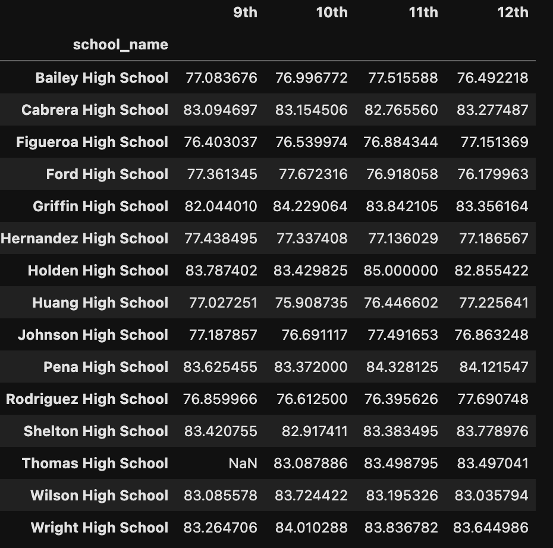
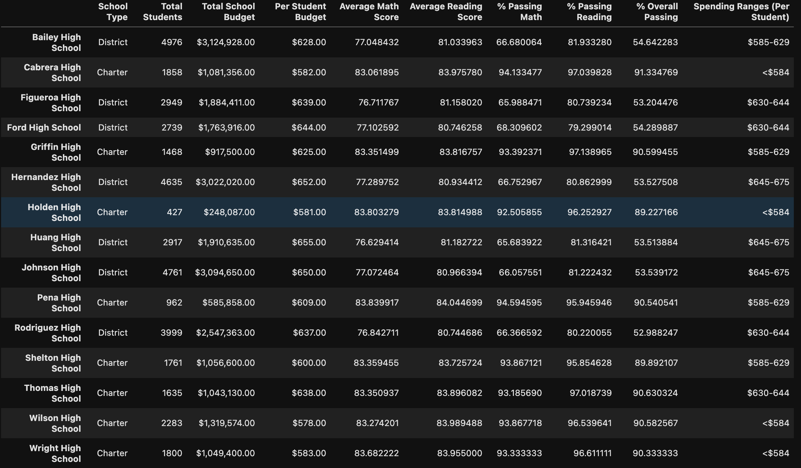
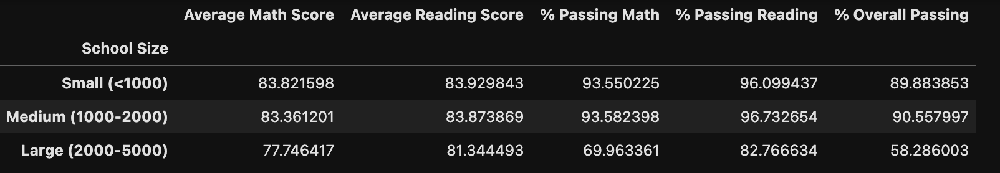
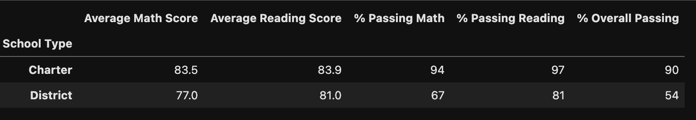

# School_District_Analysis

## Project Overview:
The school board wants to put together a school district analysis to help find any anomalies in the school data. With our knowledge of Python and the data provided, we were able to efficiently find some useful information. To start, we have to:

1. Read the School Data and Student Data and store into a Pandas DataFrame
2. Clean up all student names
3. Remove any possible anomalies to show correct data
4. Produce a District Summary
5. Produce a School Summary by sorting:
    * High and Low Performing Schools
    * Math and Reading Scores by
        * Grade
        * School Size
        * School Type
6. State conclusion based on information provided

## Resources:
* Data Source: students_complete.csv, schools_complete.csv
* Software: Python 3.8.3, Jupyter Lab, Visual Studio Code 1.46.0

# Results: 
After carefully looking through all the data, there was unusual outliers with Thomas High School. It was the only charter school that was failing, and by a large margin. We decided to later remove the seemingly skewed 9th grades test scores to come to some interesting conclusions:
## District Summary:

As you can see from the district summary image, the passing % for Thomas High School is significantly lower than the other charter schools, while maintaining higher averages. From this given information, it would prompt us to look further into this schools information.

## School Summary

We were tasked to remove the 9th grade scores from Thomas High School, as directed from the school board. After removing the 9th grade scores from Thomas High School, the students scores finally leveled out. From here, we can begin to see other changes that these adjustments have also affected, such as:

* **High and Low performing schools**

Thomas High School is now showing up in the top 5 of the performing schools. This is a significant change from before the NaN change.

* **Math and reading scores by grade**

Without looking at the 9th grade score for Thomas High School, you can see the rest of the scores tend to be very similar to other charter schools. This is more proof of the unusual activity with that 9th grade score.

* **Scores by school spending**

From this dataframe, it would seem that the schools with a smaller spending range per student tend to score higher.

* **Scores by school size**

In these 3 catagories, its clear that the large schools have a significantly lower passing average compaired to small/medium schools.

* **Scores by school type**

Out of the 2 types of schools, Charter schools are better in every catagory of education data provided.

# Summary: 

With all the new dataframes layed out, we can come to 4 major points of this analysis:
1. The 9th grade class data for Thomas High School was definitely skewed.
2. Lower funded Charter schools have higher passing % while higher funded district schools tend to have lower passing %
3. Large schools have the lowest Overall Passing % when compared to small/medium schools
4. Charter schools score higher in reading, math, and overall passing %

If it wasn't for the other schools data, the Thomas High Schools 9th grade class data might have gone unnoticed. By calculating all the school district test data, we were able to provide a detailed analysis for the school board to move forward with an investigation.

